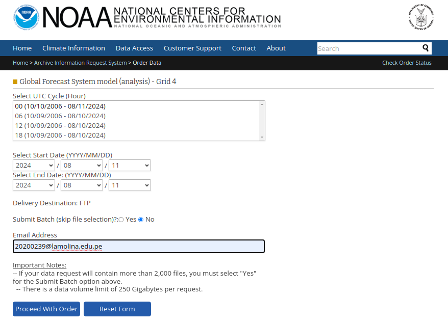

# GFS Analysis Script

## Description
This project automates the download and unpacking of GFS analysis data using a Bash script.

## Installation
1. Clone the repository:
   ```bash
   git clone https://github.com/JuanCrls17/GFS-Analysis-Script.git

## Locate:
cd GFS-Analysis-Script


## Using:
bash AUT_GFS.bash <keyword>


### 3. **Save the README.md File**

After editing, save the file. If you're using `nano`, press `Ctrl + O` to write the changes, then `Enter`, and `Ctrl + X` to exit.

### 4. **Stage and Commit the README.md File**

Once the file is created and saved, you need to stage and commit it:

1. **Stage the README.md File**:
   ```bash
   git add README.md

## GFS Data Files

The following GFS data files are available in this repository:

- [gfs_file1](GFS_data/gfs_file1)
- [gfs_file2](GFS_data/gfs_file2)

## External Resources

For more detailed information about the Global Forecast System (GFS) data, you can visit the official NOAA page:

- [NOAA Global Forecast System (GFS) Data](https://www.ncei.noaa.gov/products/weather-climate-models/global-forecast)

